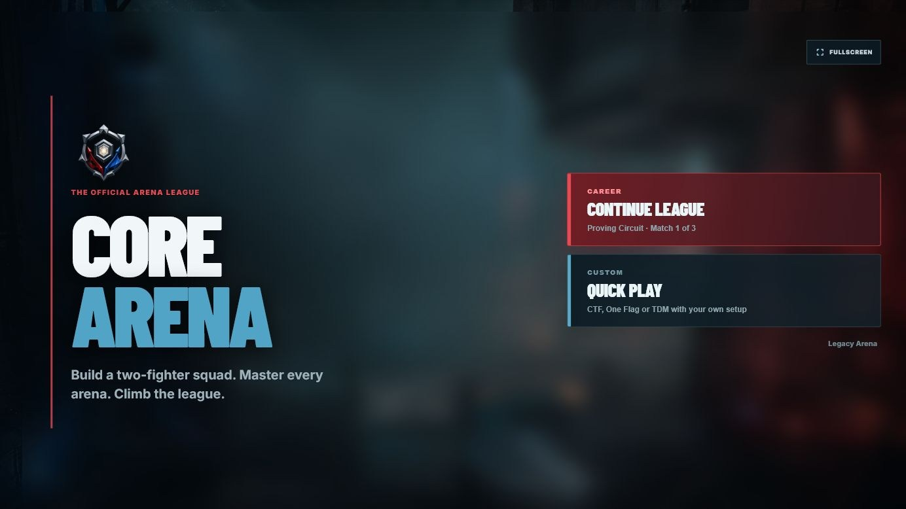
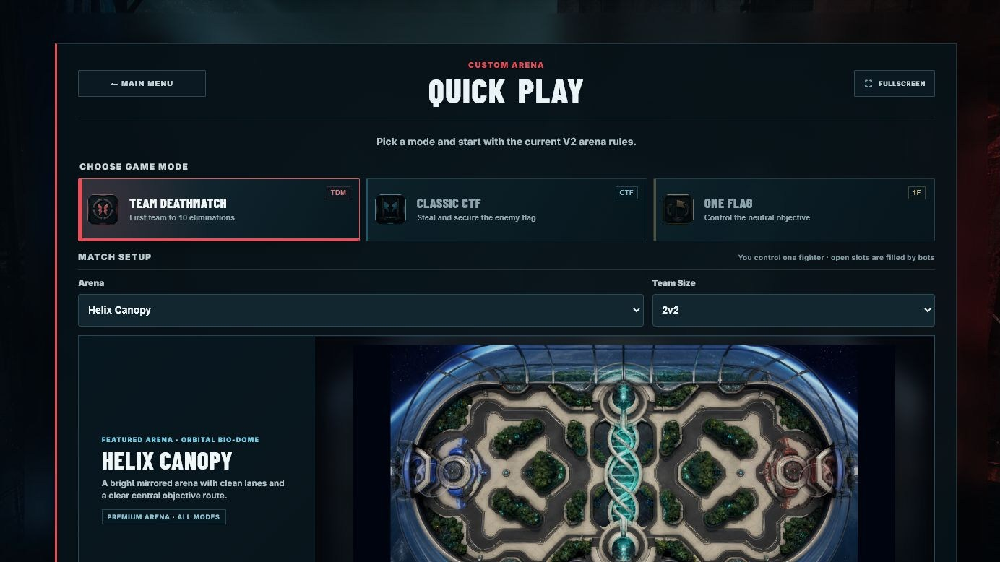
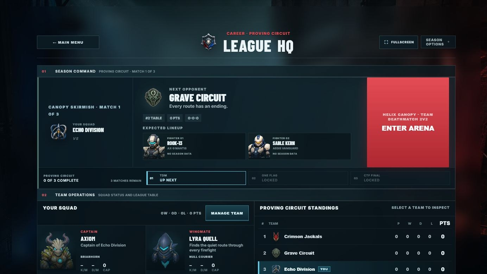
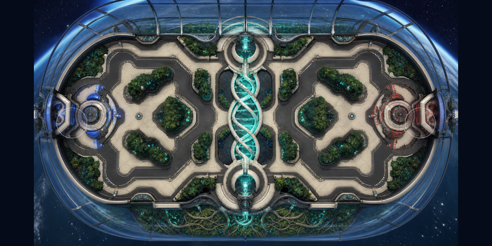
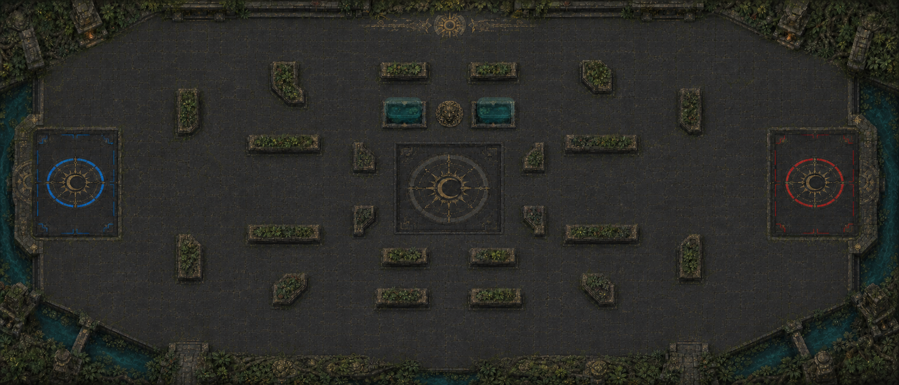
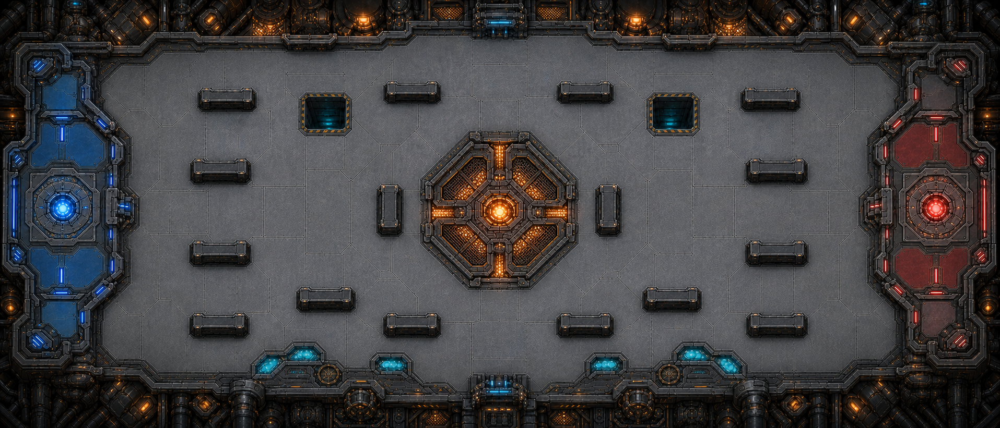

<div align="center">

# CORE ARENA

**Move fast. Read the arena. Win the objective.**

A desktop-first, browser-playable 2D top-down arena game built around movement,
aim, route knowledge, weapon control and objective pressure.

[**Play the current build**](https://emfau88.github.io/CTF-3.0/) ·
[Run locally](#quick-start) ·
[Explore the game](#what-you-can-play-today)

</div>



> [!NOTE]
> Core Arena is in active development. The current public experience is a
> single-player-versus-bots build with a complete Quick Play loop and the first
> three-match League circuit. Progress is stored locally in the browser.

## Vision

Core Arena is designed as a readable, skill-driven arena game: a match should
be understandable at a glance, but difficult to master. Movement, deliberate
jumps, aim, projectile timing, positioning, pickups, team commands and the
objective all compete for the player's attention.

The long-term goal is depth through execution and arena knowledge rather than
stat inflation. Fighter skins and wingman identities are cosmetic; every
fighter follows the same gameplay rules. A lightweight League layer gives
matches context without turning the arena into an RPG grind.

## What you can play today

### Quick Play

Configure a match, select an arena and fighter, and play from **1v1 through
4v4**. You control one fighter while every other slot is filled by bots.

| Mode | Objective | Match format |
| --- | --- | --- |
| **Team Deathmatch** | Win the elimination race | First to 10, 2-minute limit |
| **Classic CTF** | Steal and capture the enemy flag | First to 3, 3-minute limit |
| **One Flag** | Control the neutral objective | First to 3, 3-minute limit |



### League

Create a callsign and team identity, choose a captain skin and wingman, scout
the next rival, then compete through the **Proving Circuit**:

1. Team Deathmatch on Helix Canopy
2. One Flag in the Temple of the Drowned Sun
3. Classic CTF in the Temple final

League HQ tracks the four-team table, match performance and permanent cosmetic
wingman unlocks. Defeat a rival team to make its fighters available in Team
Manager. The Contender and Apex circuits are visible as honest future previews;
only the Proving Circuit is currently playable.



## Premium arenas

The current arena roster contains seven playable maps. **Helix Canopy**,
**Temple of the Drowned Sun** and **Foundry Circuit** are the three premium
arenas and define the visual, collision and competitive quality target for
future map work. The remaining arenas are playable iteration and prototype
spaces.

### Helix Canopy



A bright mirrored orbital biodome with clean lanes, readable flanks and a
luminous central helix.

### Temple of the Drowned Sun



A darker tactical arena built around layered cover, distinct flank routes and
jumpable cenotes.

### Foundry Circuit



An orbital steelworks arena with broad combat routes, maintenance-pit
shortcuts and the contested Forge Heart at its center.

## Arena systems

- Fast directional movement, deliberate jumping and gap traversal
- Health, armor, respawns and short spawn protection
- Map-specific four-weapon rosters with an unlimited **Arc Lash** plus
  contested **Rocket**, **Rail**, **Pulse Repeater**, **Ricochet Disc**,
  **Lob Grenade** and **Shardcaster** pickups
- Team commands for **Defend**, **Follow** and **Attack**
- Team rings, fighter outlines and a dedicated player marker for combat clarity
- Fullscreen support, scalable HUD, match feed and hold-to-view statistics
- Nine cosmetic fighter skins with identical gameplay rules
- Coordinated bots with limited perception, mode-aware roles, weapon-aware
  movement, local evasion and staged navigation recovery

## Controls

| Input | Action |
| --- | --- |
| `WASD` | Move |
| Mouse | Aim |
| `Space` | Jump |
| `Q` | Fire Rocket when available |
| `E` | Fire Rail when available |
| `F` | Use Arc Lash when available |
| `R` | Fire Pulse Repeater when available |
| `C` | Throw Ricochet Disc when available |
| `G` | Lob Grenade at the cursor |
| `X` | Fire Shardcaster when available |
| `Home` | Re-center the manually panned spectator camera |
| `Shift` + `R` | Restart a finished match |
| `1` / `2` / `3` | Defend / Follow / Attack squad command |
| Hold `Tab` | Match statistics |
| `M` | Pause and match menu |

Core Arena is developed desktop-first. A landscape touch interface exists as
an experimental secondary control path, but desktop keyboard and mouse remain
the primary target.

## Technology

- **TypeScript 5.8**
- **Phaser 3.90** for browser rendering and scene integration
- **Vite 7** for local development and production builds
- A framework-neutral gameplay core separated from Phaser rendering, input and
  audio adapters
- Node-based automated gameplay, UI, map-quality and bot-simulation tests

## Quick start

Requirements: a current Node.js installation and npm.

```bash
git clone https://github.com/emfau88/CTF-3.0.git
cd CTF-3.0
npm install
npm run dev
```

Open [http://127.0.0.1:5173/CTF-3.0/](http://127.0.0.1:5173/CTF-3.0/).

### Validation

```bash
npm test
npm run test:typecheck
npm run build
npm run bot:audit:premium
```

Map authors and reviewers should read the
[premium-map production guide](docs/HIGH_QUALITY_MAP_PRODUCTION_GUIDE.md)
before creating a new arena or changing collision on an existing one.
The reusable bot architecture and mandatory map contract are documented in
[Bot-KI v2](docs/BOT_AI_V2_ARCHITECTURE.md); the saved Premium-Map matrix is
described in the
[bot audit guide](docs/PREMIUM_MAP_BOT_BEHAVIOR_AUDIT.md).

## Current direction

Development is focused on:

- bringing future arenas up to the Helix, Temple and Foundry quality bar
- expanding League progression beyond the Proving Circuit
- deepening presentation and usability without sacrificing visible map space
- continuing bot, responsive-layout and experimental touch-control refinement

Online multiplayer, local PvP, account services and cloud saves are not part of
the current playable build.
