<div align="center">

# CORE ARENA

**Move fast. Read the arena. Win the objective.**

A browser-playable 2D top-down arena game built around movement, aim, route
knowledge, weapon control and objective pressure. Keyboard and mouse remain the
primary precision controls; a dedicated landscape touch layout supports mobile
play.

[**Play the current build**](https://emfau88.github.io/CTF-3.0/) ·
[Run locally](#quick-start) ·
[Explore the game](#what-you-can-play-today)

</div>

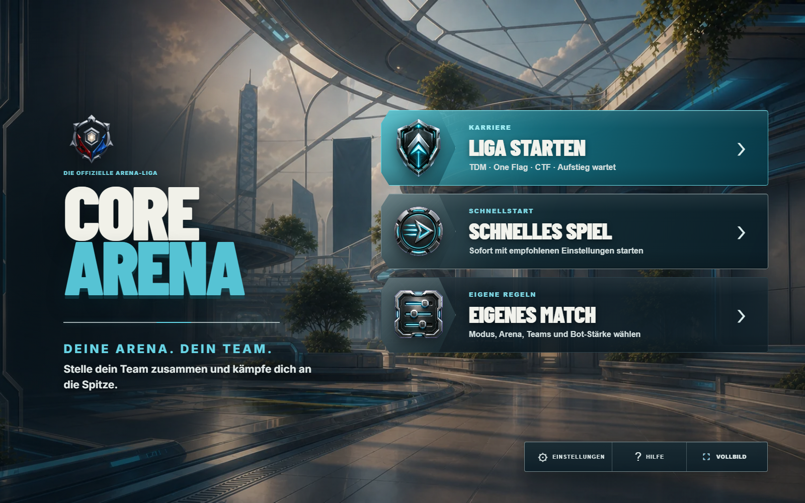

> [!NOTE]
> Core Arena is in active development. The current public experience is a
> single-player-versus-bots build with instant Quick Start, a configurable
> Custom Match flow and the first three-match League circuit. Progress and UI
> language are stored locally in the browser. Online multiplayer, accounts and
> cloud saves are not implemented.

The binding product sequence, release gates and current phase are maintained in
the [canonical Core Arena release roadmap](docs/CORE_ARENA_RELEASE_ROADMAP.md).
Older plans remain useful as historical or technical references, but are not
the current release backlog.

## Development update — August 24, 2026

- The complete menu surface now uses the higher-fidelity **Arena Twilight**
  visual system: a brighter sci-fi arena backdrop, beveled action cards,
  stronger hierarchy and consistent framing across Main Menu, Custom Match,
  League HQ, Settings and Help.
- The three Main Menu actions now use purpose-built, alpha-transparent
  ImageGen emblems for Career, Quick Start and Custom Match instead of generic
  interface glyphs.
- All new menu copy is available in **German and English**. Language changes
  immediately and persists on the current device.
- **Quick Start** launches a recommended match immediately. **Custom Match** is
  now a four-step flow for mode, arena, teams and final review instead of one
  dense form.
- Premium-arena previews use the complete map image without cropping. On
  desktop, Custom Match keeps a live match summary beside every setup step and
  keeps the Arena navigation visible without page scrolling down to 1366 × 768.
  The refreshed League HQ puts the complete next-match decision, current squad
  and league path in the first desktop viewport; the detailed table remains
  available below. It shows the playable Proving Circuit plus the planned
  Contender and Apex circuits without presenting them as finished.
- Menus adapt to desktop, compact landscape and mobile portrait viewports.
  Fullscreen controls are synchronized across the menu and the compact
  top-right match toolbar when the browser supports the Fullscreen API.
- Mobile gameplay retains its separate compact action arc, top HUD and combat
  log. The camera uses a closer 1120 × 640 minimum view and direct,
  frame-rate-independent following.

<p align="center">
  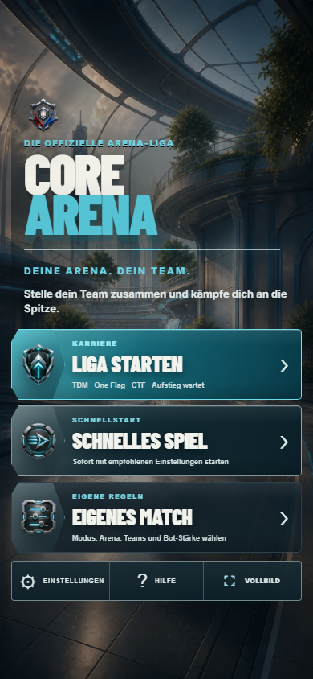
</p>

Recent gameplay and arena milestones remain in the current build:

- **Helix Canopy v2.1** replaces the dense organic combat court with readable
  rectangular planters, three broad routes and a walkable under-glass helix.
  The original master remains archived in the repository.
- Quick Play supports asymmetric teams and separate **Easy**, **Normal** and
  **Hard** bot settings for both sides—for example, the player plus two Hard
  bots against three Easy bots.
- A synchronized two-second match countdown now holds every player, bot and
  timer until the simulation starts for everyone at once.
- Landscape touch controls use each arena's real weapon roster and a compact
  mobile-only action arc, top HUD and combat log. Desktop controls and layout
  remain separate.
- Repeated HUD and pickup drawing was reduced. In the reproducible 4v4
  software-WebGL stress test, main-thread task time fell by about 15% and
  script time by about 20%; real-device GPU profiling remains an open gate.
- Premium-map resources now follow one readable baseline: four Health, two
  Armor and five weapon pickups per arena. Health restores 75 points, while
  Grenade and Shardcaster use dedicated in-game art instead of placeholders.
- Automatic input detection applies the same touch result to the Phaser
  controls and the HTML utility bar, keeping the mobile menu and fullscreen
  action in the top-right toolbar rather than near combat buttons.
- The mobile arena camera now shows a closer 1120 × 640 minimum view, follows
  the player with frame-rate-independent damping and snaps cleanly after
  respawns. Main Menu, Quick Play and League are available in portrait mode;
  landscape remains the intended match orientation.

The menu implementation and QA evidence are documented in the
[menu refresh record](docs/MENU_REFRESH_2026-08-24.md). The source audit,
verified gameplay implementation status and open work are collected in the
[audit status](docs/audits/CTF-3.0_Audit_STATUS_2026-08-05.md) and
[Phase 3 QA record](docs/qa/phase-3-mobile-runtime/README.md). The current
practical maintainability, dependency and rendering assessment is captured in
the [architecture stability check](docs/audits/ARCHITECTURE_STABILITY_2026-08-24.md).

## Vision

Core Arena is designed as a readable, skill-driven arena game: a match should
be understandable at a glance, but difficult to master. Movement, deliberate
jumps, aim, projectile timing, positioning, pickups, team commands and the
objective all compete for the player's attention.

The long-term goal is depth through execution and arena knowledge rather than
stat inflation. Fighter skins and wingman identities are cosmetic; every
fighter follows the same gameplay rules. A lightweight League layer gives
matches context without turning the arena into an RPG grind.

## What you can play today

### Quick Start and Custom Match

Quick Start immediately launches a recommended TDM setup. Custom Match lets
you select mode, premium arena, fighter and independent team configuration from
**1v1 through 4v4**. You control one fighter while every other slot is filled
by bots. Bot count and **Easy**, **Normal** or **Hard** difficulty can be set
separately for the blue and red teams.

| Mode | Objective | Match format |
| --- | --- | --- |
| **Team Deathmatch** | Win the elimination race | First to 10, 2-minute limit |
| **Classic CTF** | Steal and capture the enemy flag | First to 3, 3-minute limit |
| **One Flag** | Control the neutral objective | First to 3, 3-minute limit |

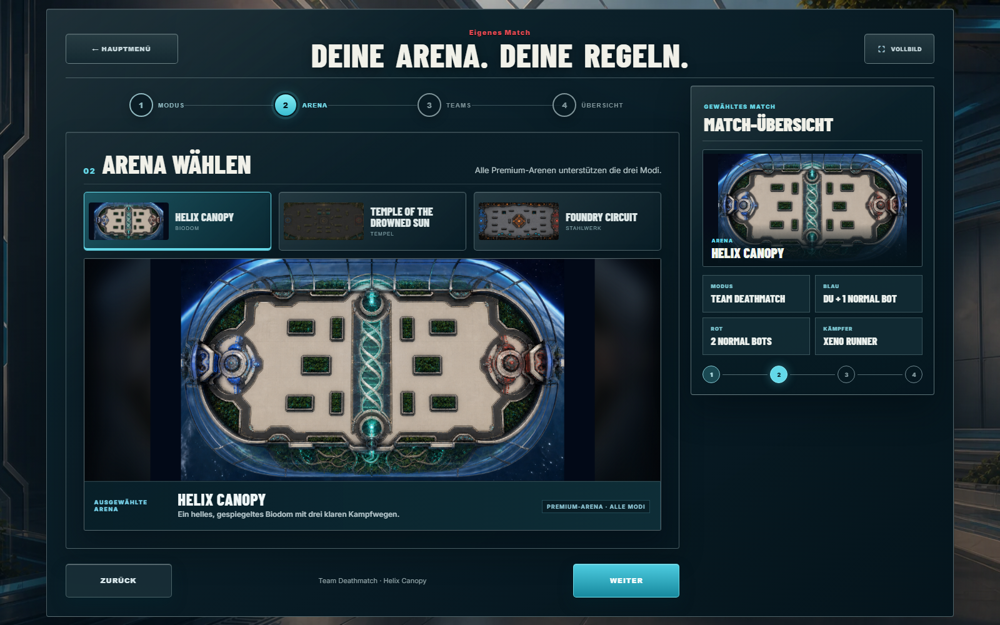

### League

Create a callsign and team identity, choose a captain skin and wingman, scout
the next rival, then compete through the **Proving Circuit**:

1. Team Deathmatch on Helix Canopy
2. One Flag in the Temple of the Drowned Sun
3. Classic CTF in the Temple final

League HQ tracks the four-team table, match performance and permanent cosmetic
wingman unlocks. Defeat a rival team to make its fighters available in Team
Manager. The Contender and Apex circuits are visible as honest future previews;
only the Proving Circuit is currently playable.

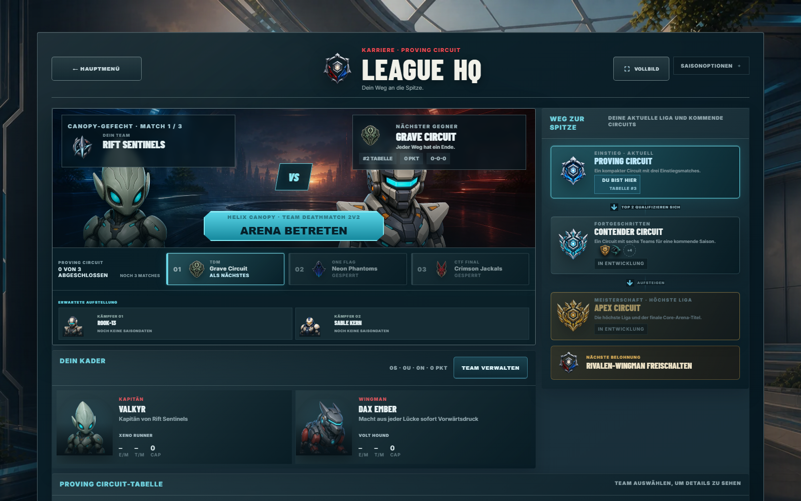

## Premium arenas

The current arena roster contains seven playable maps. **Helix Canopy**,
**Temple of the Drowned Sun** and **Foundry Circuit** are the three premium
arenas and define the visual, collision and competitive quality target for
future map work. The remaining arenas are playable iteration and prototype
spaces.

### Helix Canopy

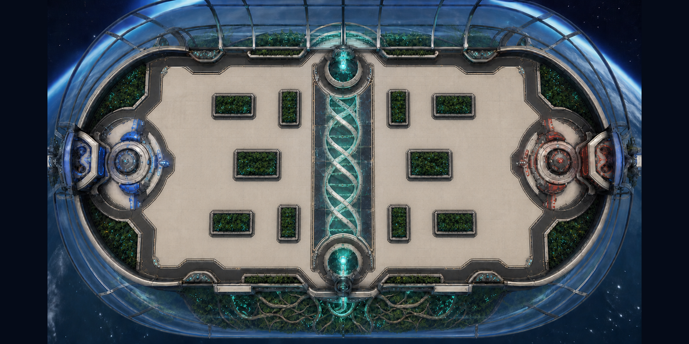

A bright mirrored orbital biodome with clean lanes, readable flanks and a
luminous central helix.

### Temple of the Drowned Sun

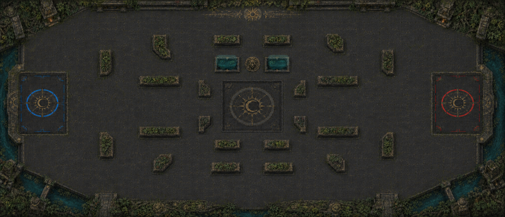

A darker tactical arena built around layered cover, distinct flank routes and
jumpable cenotes.

### Foundry Circuit

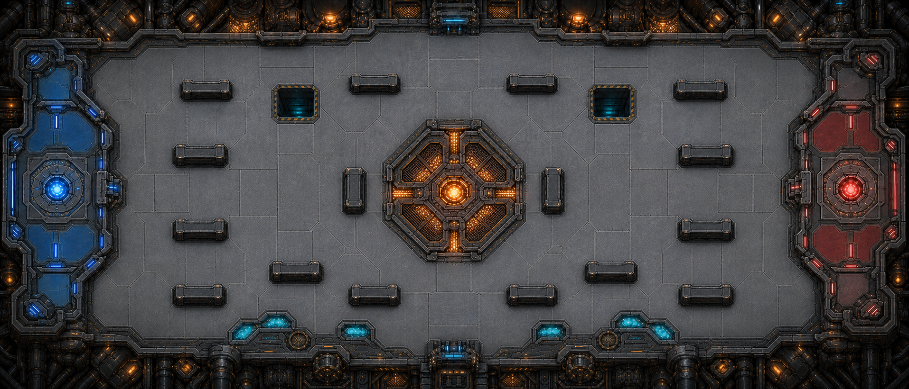

An orbital steelworks arena with broad combat routes, maintenance-pit
shortcuts and the contested Forge Heart at its center.

## Arena systems

- Fast directional movement, deliberate jumping and gap traversal
- Health, armor, respawns and short spawn protection
- Map-specific four-weapon rosters with an unlimited **Arc Lash** plus
  contested **Rocket**, **Rail**, **Pulse Repeater**, **Ricochet Disc**,
  **Lob Grenade** and **Shardcaster** pickups
- Team commands for **Defend**, **Follow** and **Attack**
- Team rings, fighter outlines and a dedicated player marker for combat clarity
- Fullscreen support, scalable HUD, match feed and hold-to-view statistics
- Nine cosmetic fighter skins with identical gameplay rules
- Coordinated bots with limited perception, mode-aware roles, weapon-aware
  movement, local evasion and staged navigation recovery

## Weapons

Every arena gives each fighter the unlimited **Arc Lash** as a dependable
standard weapon, then adds at most three contested pickup weapons. The mouse
wheel cycles through weapons that are currently usable and left click fires
the selected weapon. The displayed weapon keys remain direct-fire shortcuts
and also select that weapon for the next click.

| Weapon | In-game art | Combat role |
| --- | --- | --- |
| **Arc Lash** (`F`) | 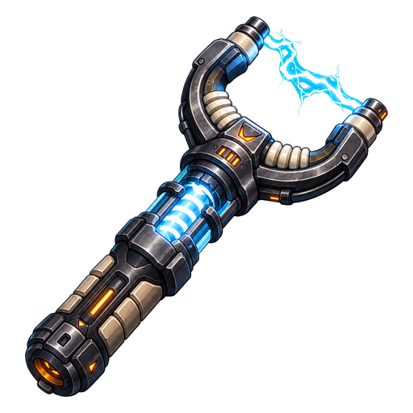 | Unlimited short-range automatic targeting. Reliable fallback, but opponents can keep their distance. |
| **Rocket Launcher** (`Q`) | 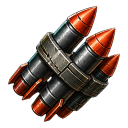 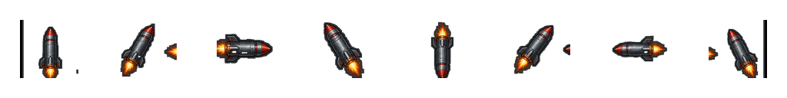 | Slow, readable splash projectile with knockback. Direct hits are strongest; walls and spacing provide counterplay. |
| **Railgun** (`E`) | 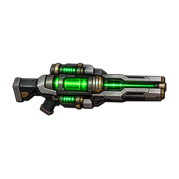 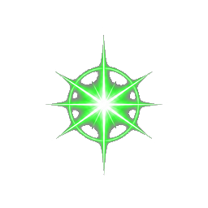 | Long-range hitscan precision weapon. High impact, scarce ammunition and a long cooldown reward deliberate aim. |
| **Pulse Repeater** (`R`) | 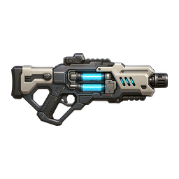 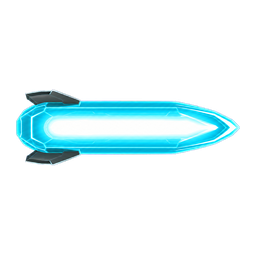 | Fast mid-range tracking weapon. Sustained accuracy matters more than a single burst hit. |
| **Ricochet Disc** (`C`) | 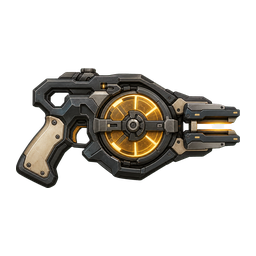 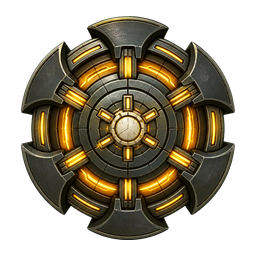 | Banks up to three times from walls and gains damage after a bounce. It stops immediately when it hits an opponent. |
| **Lob Grenade** (`G`) | 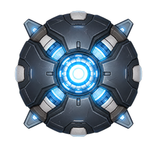 | Arcs over walls toward the cursor, lands with a visible fuse and controls a local area without affecting terrain. |
| **Shardcaster** (`X`) | 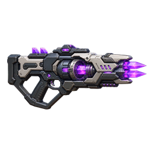 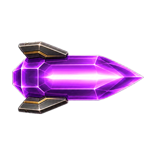 | Fires low-damage seeking shards. Six hits from the same attacker trigger a local resonance burst on that target. |

Premium-map weapon rosters:

| Arena | Weapons available in the match |
| --- | --- |
| **Helix Canopy** | Arc Lash, Railgun, Pulse Repeater, Shardcaster |
| **Temple of the Drowned Sun** | Arc Lash, Rocket Launcher, Lob Grenade, Ricochet Disc |
| **Foundry Circuit** | Arc Lash, Rocket Launcher, Railgun, Ricochet Disc |

Pickup weapons require ammunition and only appear on maps whose roster includes
them. Arc Lash is always available and never consumes ammunition.

## Controls

| Input | Action |
| --- | --- |
| `WASD` | Move |
| Mouse | Aim |
| Mouse wheel | Select Arc Lash or a collected weapon with ammunition |
| Left click | Fire the selected weapon |
| `Space` | Jump |
| `Q` | Direct-fire and select Rocket when available |
| `E` | Direct-fire and select Rail when available |
| `F` | Direct-fire and select Arc Lash |
| `R` | Direct-fire and select Pulse Repeater when available |
| `C` | Direct-fire and select Ricochet Disc when available |
| `G` | Direct-fire and select Lob Grenade when available |
| `X` | Direct-fire and select Shardcaster when available |
| `Home` | Re-center the manually panned spectator camera |
| `Shift` + `R` | Restart a finished match |
| `1` / `2` / `3` | Defend / Follow / Attack squad command |
| Hold `Tab` | Match statistics |
| `M` | Pause and match menu |

Desktop keyboard and mouse remain the primary precision path. The menus are
responsive in portrait and landscape; matches are intended for landscape.
The touch interface has automated browser coverage for the rebuilt Helix map
in all three modes and uses map-specific weapon buttons plus a compact HUD.
Real-device GPU and touch-feel profiling remains an open release gate.

## Audit and roadmap status

The original technical audit was checked against the project and converted
into six implemented phases:

- reproducible map baselines and visual diagnostics
- Helix Canopy v2.1 with aligned art and collision
- independently configurable bot teams and three difficulty profiles
- synchronized match start, mobile HUD/camera work and runtime reductions
- consistent premium-map pickup economy and named map landmarks
- landmark-aware bot strategy, pickup reservations and difficulty-specific
  jump behavior across TDM, Classic CTF and One Flag

The August 24 menu refresh is an additional product/UI phase, not a claim that
the remaining gameplay work is finished. The important open gates are manual
difficulty calibration, a clean full 270-match premium audit, a graph check for
two independent base-to-objective routes, real mobile hardware profiling and
League progression beyond the Proving Circuit. See the
[verified audit status](docs/audits/CTF-3.0_Audit_STATUS_2026-08-05.md) for the
detailed evidence and limitations.

## Technology

- **TypeScript 5.8**
- **Phaser 3.90** for browser rendering and scene integration
- **Vite 7** for local development and production builds
- A framework-neutral gameplay core separated from Phaser rendering, input and
  audio adapters
- Node-based automated gameplay, UI, map-quality and bot-simulation tests

## Quick start

Requirements: a current Node.js installation and npm.

```bash
git clone https://github.com/emfau88/CTF-3.0.git
cd CTF-3.0
npm install
npm run dev
```

Open [http://127.0.0.1:5173/CTF-3.0/](http://127.0.0.1:5173/CTF-3.0/).

### Validation

```bash
npm test
npm run test:typecheck
npm run build
npm run test:e2e
npm run bot:audit:premium
```

Map authors and reviewers should read the
[premium-map production guide](docs/HIGH_QUALITY_MAP_PRODUCTION_GUIDE.md)
before creating a new arena or changing collision on an existing one.
The reusable bot architecture and mandatory map contract are documented in
[Bot-KI v2](docs/BOT_AI_V2_ARCHITECTURE.md); the saved Premium-Map matrix is
described in the
[bot audit guide](docs/PREMIUM_MAP_BOT_BEHAVIOR_AUDIT.md).

## Current direction

Development is focused on:

- completing the reproducible release baseline on `main` before product work;
- introducing clean release-profile and platform-service boundaries;
- building a one-click Qualifier and contextual first-run onboarding;
- simplifying the transition into the three-match Proving Circuit;
- making Recruitment meaningful through bot behavior rather than stat bonuses;
- validating that full loop with new players before expanding Contender or Apex;
- treating desktop as the supported release path while retaining mobile as an
  experimental path.

Audio is intentionally excluded from all of these phases. It will be handled
only in the final audio-and-polish phase, including provenance and rights review.

Online multiplayer, local PvP, account services and cloud saves are not part of
the current playable build.
